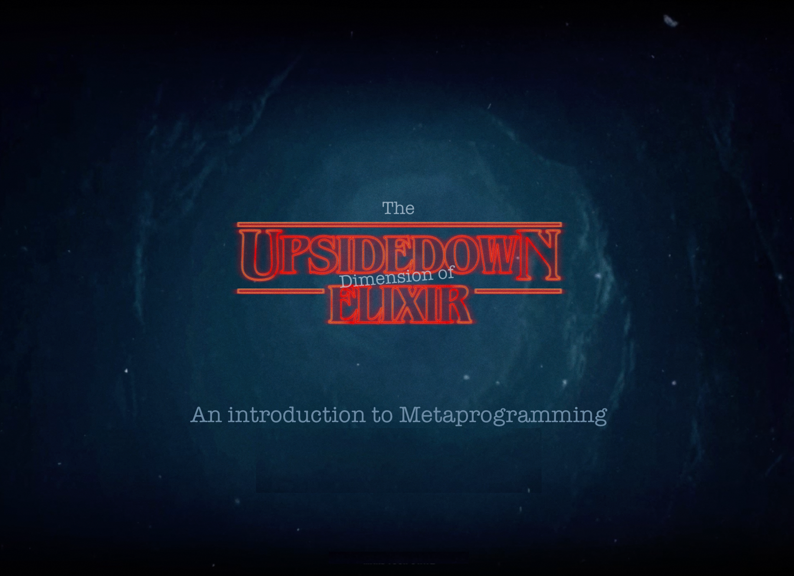
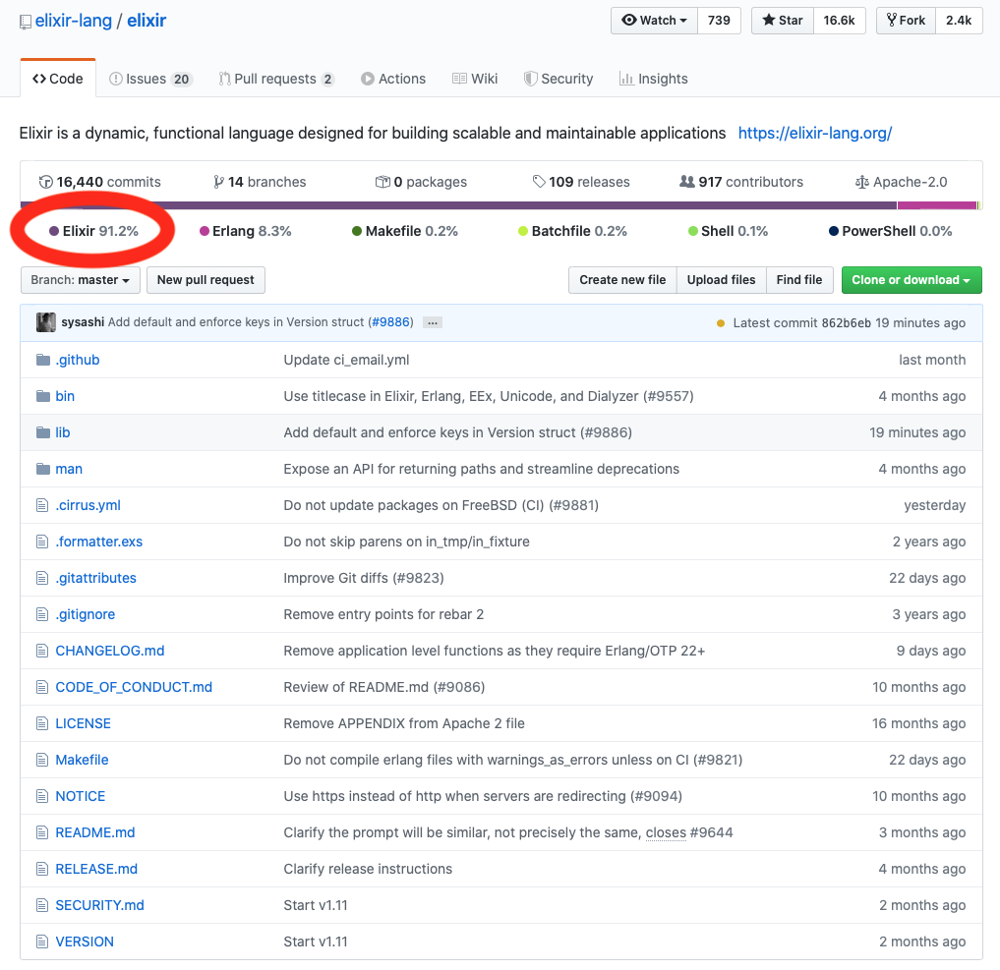

theme: Courier
footer: The Upside Down Dimension of Elixir - @nicholasjhenry
slidenumbers: true
slidecount: true
background-color: #0C3246
header: #FFFFFF
text: #FFFFFF
presenter-notes: text-scale(2)
table-separator: #FFF, stroke-width(1)

# (this slide is intended to be blank)

---
[.hide-footer]



---

## Are you tired of having to write the same boilerplate code in multiple modules?

---

## Do you wish you could program in a language that more closely reflected the domain you are working in?

---

## Is there a feature you wished existed in the Elixir language?

---

## Open the gate into the Upside Down Dimension that is Metaprogramming in Elixir

^
Let's open the gate to the UpsideDown Dimension of Elixir and learn write code that writes code
With metaprogramming you will be able to...

---

# Metaprogramming is a tool that gives you super powers like a Mind Slayer

---

# Metaprogramming allows you to write code that writes code

---
[.background-color: #FFF]
[.header: #000]
[.text: #000]

# Remove boilerplate code

```elixir
iex> mix phx.new UpsideDown

defmodule UpsideDownWeb do
  # Extends controllers, views, channels, router
  # ...

  def controller do
    # ...
  end

  # ...

  defmacro __using__(which) when is_atom(which) do
    apply(__MODULE__, which, [])
  end
end

defmodule UpsideDownWeb.PageController do
  use UpsideDownWeb, :controller

  def index(conn, params) do
    # ...
  end
end
```

^
As Phoenix does when it generates a Web module which is used by controller, views, channels and the router

---
[.background-color: #FFF]
[.header: #000]
[.text: #000]

# Write Domain Specific Languages (DSL)

```elixir
markup do
  div id: "main" do
    h1 class: "title" do
      text "Welcome!" end
    end

    div class: "row" do
      div do
        p do: text "Hello!"
      end
    end
  end
end
```

---
[.background-color: #FFF]
[.header: #000]
[.text: #000]

# Extend the language

```elixir
while x > 1 do
  # ...
end
```

^
Missing a while loop?

---

# Goals

1. Demystify metaprogramming in Elixir
2. Build a mental model and understand the core concepts
3. Read and write basic macros

^
My goal..
Will not cover every aspect

---
# Prerequisite

- Basic Elixir syntax
- Working knowledge helpful

---
[.background-color: #FFF]
[.header: #000]
[.text: #000]

# My Experience: Typist

```elixir
# https://github.com/civilcode/typist

defmodule Product do
  use Typist

  deftype Code :: String.t
  deftype Price :: Decimal.t

  deftype do
    code :: Product.Code.t
    price :: Product.Price.t
  end
end
```

^
First a little Background

---

# Approach

1. Review a simple macro
2. Learn key concepts
3. Demo those concepts
4. Multiple points of review and questions
5. Revisit the macro

---

[.background-color: #FFF]
[.header: #000]
[.text: #000]

# Example

- `ExCalculator.add/2`
- `ExTracer.trace/1`

```elixir
iex> ExCalculator.add(1, 2)
3
iex> x = 1
...> y = 2
...> require ExTracer
...> ExTracer.trace(x + y)
Running x + y returns 3
```

---

# Demo

Calculator with Tracer call

^
callout the three functions

---

# The 3 keys to the open the gate

- `defmacro/2`
- `quote/2`
- `unquote/1`

---

# How do we write code that writes code?

```
                          ┌─────────────────┐
Elixir source code ──────▶│    Compiler     │──────────▶ byte code
                          └─────────────────┘
                                   ▲
                                   │
                                   │
                                   │
                                macros
                    (the body is expanded inline)
```

---

# Comparison

|    Human World    |  Upside Down Dimension  |
| ----------------- | ----------------------- |
| (business logic)  | (code generation)       |
| run-time          | compile-time            |
| high level syntax | internal data structure |
| functions         | macros                  |

^
I like to think: "Compile-time" programming
Drive the talk
Compare each of these items

---

# Questions

---

# 1. Run-time / Compile-time

---

# Compilation Process

```
                          ┌─────────────────┐
Elixir source code ──────▶│    Compiler     │──────────▶ byte code
                          └─────────────────┘
```

---

# Part 1: Demo

1. Code can be executed at compile-time
2. Common confusion with run-time vs compile-time

---

# Review / Questions

|      Run-time      |    Compile-time     |
| ------------------ | ------------------- |
| execute code       | execute code        |
| dynamic nature     | static nature       |
| executes byte-code | generates byte-code |

---

# 2. High-level Syntax / Internal Data Structure

---

# Compilation Process

```
                          ┌─────────────────┐
Elixir source code ──────▶│    compiler     │──────────▶ byte code
                          └─────────────────┘
                                   ▲
                                   │
                                   │
                                   │
                                macros
```

---

# Compilation Process

```
                          ┌─────────────────┐
Elixir source code ──────▶│     parser      │
                          └─────────────────┘
                                   │
                                   │   internal data structure
                                   │
                                   ▼
                          ┌─────────────────┐
                          │    generator    │──────────▶ byte code
                          └─────────────────┘
```

---

# Can we access this data structure?

---

# The first key: `quote/2`

^Our first key to the Upside Down dimension of Elixir

---

# Demo

1. Review quote in Tracer
2. Explore `quote/2`

^
2_demo.ex / Script

---
[.background-color: #FFF]
[.header: #000]
[.text: #000]

# Internal Data Structure

```
# (1 + (2 * 3)) - 4

{:-, [context: Elixir, import: Kernel],
 [
   {:+, [context: Elixir, import: Kernel],
    [1, {:*, [context: Elixir, import: Kernel], [2, 3]}]},
   4
 ]}
```

---
[.background-color: #FFF]
[.header: #000]
[.text: #000]

# Remove metadata

```
# (1 + (2 * 3)) - 4

{:-, [],
 [
   {:+, [],
    [1, {:*, [], [2, 3]}]},
   4
 ]}
```

---
[.background-color: #FFF]
[.header: #000]
[.text: #000]

# Remove syntax

```
# (1 + (2 * 3)) - 4

:-
    :+
        1
        :*
            2
            3
    4
```
---

# Tree structure
[.background-color: #FFF]
[.header: #000]
[.text: #000]

```
# (1 + (2 * 3)) - 4

                ┌────┐
                │ -  │  (3)
                └────┘
                   │
          ┌────────┴────────┐
          │                 │
       ┌────┐            ┌────┐
       │ +  │ (7)        │ 4  │
       └────┘            └────┘
          │
   ┌──────┴──────┐
   │             │
┌────┐        ┌────┐
│ 1  │        │ *  │ (6)
└────┘        └────┘
                 │
         ┌───────┴───────┐
         │               │
      ┌────┐          ┌────┐
      │ 2  │          │ 3  │
      └────┘          └────┘
```

---

# Abstract Syntax Tree (AST)

```
{function, metadata, [arg]} => {function, metadata, [ast]}
```

- a tree representation
- syntactical structure of source code
- optimized for machines
- input to generate byte code

---

# Lisp

- `(* 2 (+ 3 4))`
- parenthesized lists
- **power over readability** (extensibility, DSL's)

---

# Elixir's approach

- human world: higher level syntax
- upside down dimension: AST
- **power and readability** (extensibility, DSL's)

---
[.background-color: #FFF]
[.header: #000]
[.text: #000]

# `quote/2`

- allows us to write AST in a higher level syntax

```elixir
  # not fun :(, but possible
  {:-, [],
    [
      {:+, [], [1, {:*, [], [2, 3]}]},
      4
    ]}

  # moz def fun!
  quote do
    1 + (2 * 3) - 4
  end
```

---

# Elixir is written in Elixir (mostly)

---

[.background-color: #FFF]



---

# Demo

Let's look at the humble `if` statement

^
2_demo.ex

---

# Review / Questions

- `quote/2` generates an AST (internal data structure)
- `{function, metadata, [ast]}` => `Macro.t`
- Elixir is written in Elixir (90%)

---

# Let's take a break

---

# Before moving on

|    Human World    |  Upside Down Dimension  |
| ----------------- | ----------------------- |
| (business logic)  | (code generation)       |
| run-time          | compile-time            |
| high level syntax | internal data structure |
| functions         | macros                  |

Keys: `defmacro/2`, `quote/2`, `unquote/1`

---

# 3. Functions / Macros

---
[.background-color: #FFF]
[.header: #000]
[.text: #000]

# The second key: `defmacro/2`

```elixir

def add(x, y) do
  # programming for run-time
  # ...
end

defmacro trace(code) do
  # programming for compile-time
  # ...
end
```

---

# Comparison

|       `def/2`        |         `defmacro/2`         |
| -------------------- | ---------------------------- |
| `term` => `term`     | `Macro.t` => `Macro.t` (ast) |
| invoked at run-time  | invoked at compile-time      |
| current context      | macro and caller context     |

---

# Demo

1. Macro AST => AST
2. Macros invoked at compile time
3. Macro / Caller context

^
Demonstrate all three

---

# Compilation Process

```
                          ┌─────────────────┐
Elixir source code ──────▶│     parser      │
                          └─────────────────┘
                                   │
                                   │   internal data structure
                                   │
                                   ▼
                          ┌─────────────────┐
                          │    generator    │──────────▶ byte code
                          └─────────────────┘
```

---

# Macro Expansion

```
                          ┌─────────────────┐
Elixir source code ──────▶│     parser      │
                          └─────────────────┘
                                   │
                                   │            raw AST
                                   │
                                   ▼
                          ┌─────────────────┐
                          │    expansion    │ (macros invoked)
                          └─────────────────┘
                                   │
                                   │          expanded AST
                                   │
                                   ▼
                          ┌─────────────────┐
                          │    generator    │──────────▶ byte code
                          └─────────────────┘
```

---

#  Demo

- The expansion stage invokes the macro.
- Macros inject into the AST

^
!!!!!!!! This is the gold!

---

# The third key: `unquote/1`

- Construct the AST dynamically
- Not the reverse of `quote/2`
- Think string interpolation for code

```
"#{x} + 1"
```

---

# Demo `unquote/1`

---

# Review / Questions

|       `def/2`       |          `defmacro/2`          |
| ------------------- | ------------------------------ |
| `term` => `term`    | `Macro.t` => `Macro.t` (ast)   |
| invoked at run-time | invoked at compile-time        |
| current context     | macro and caller context       |

---

#  Final Demo

- Review `ExTracer.trace/1`
- Annotate

---

# The Upside Down Dimension of Elixir

---

# Advanced concepts

- Accumulating module attributes (`ExUnit`)
- Compile-time hooks (`__before_compile__`)
- Generate code from external data (files, API's, databases)

---

# Final Review

|    Human World    |  Upside Down Dimension  |
| ----------------- | ----------------------- |
| (business logic)  | (code generation)       |
| run-time          | compile-time            |
| high level syntax | internal data structure |
| functions         | macros                  |

---

# Features

1. Remove boilerplate code
2. Write Domain-Specific Languages (DSL)
3. Add new language constructs

---

# Books

* [Metaprogramming in Elixir](https://pragprog.com/book/cmelixir/metaprogramming-elixir)
* [Programming Elixir 1.6](https://pragprog.com/book/elixir16/programming-elixir-1-6) - Macros and Code Evaluation

---

# Online Resources

* Elixir - [Getting Started](https://elixir-lang.org/getting-started/meta/macros.html)
* Elixir Docs - [Macro](https://hexdocs.pm/elixir/Macro.html) and [Code](https://hexdocs.pm/elixir/Code.html)
* Elixir School - [Metaprogramming](https://elixirschool.com/en/lessons/advanced/metaprogramming/)
* [Understanding Elixir Macros](https://www.theerlangelist.com/article/macros_1) - Saša Jurić

---

# Next Steps

* Download this repo and play (https://github.com/nicholasjhenry/upside-down-elixir)
* Look at the source for `if/2` and `GenServer`
* Read "Understanding Elixir Macros" blog post ("trace example")

---

# Have fun in the Upside Down Dimension of Elixir :-)